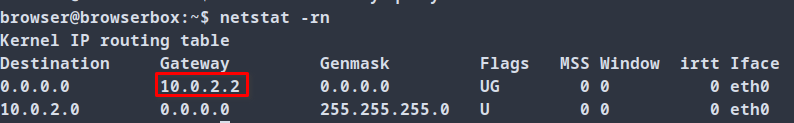

1. Load vbox using command `VBoxManage registervm /home/gwips/vbox/browserbox.vbox` . Path should be full.
2. Check vbox in the list `VBoxManage list vms`
3. To start the vbox : `VBoxManage startvm browserbox --type headless`
4. SSH login `ssh browser@localhost -p 1235`, password should be `browserbox`
5. Add port forwarding to accessible from other computers `VBoxManage modifyvm browserbox --natpf1 "gwips,tcp,0.0.0.0,1234,,80"` if virtual box is not running.
6. Add port forwarding to accessible from other computers `VBoxManage controlvm browserbox natpf1 "gwips,tcp,0.0.0.0,1234,,80"` if virtual box is running.
7. If you and to remove the port `VBoxManage modifyvm browserbox --natpf1 delete "gwips"`
8. Execute verstualbox `VBoxManage controlvm browserbox poweroff`, deatils at [check this](https://www.techrepublic.com/article/how-to-run-virtualbox-virtual-machines-from-the-command-line/)
9. To poweroff `VBoxManage controlvm browserbox poweroff`

# Connecting to host mysql

1. Login to virtualbox using ssh
2. Execute command `netstat -rn`. I will generate figure 1.
3. Edit `sudo vim /etc/mysql/my.cnf`
4. Chage host to `10.0.2.2`, and user and password to host mysql usename and password.
5. Retart mysql - `sudo service mysql restart`

